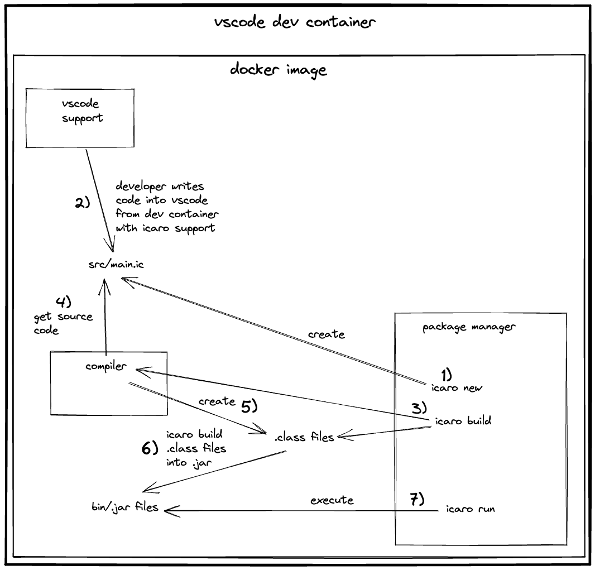
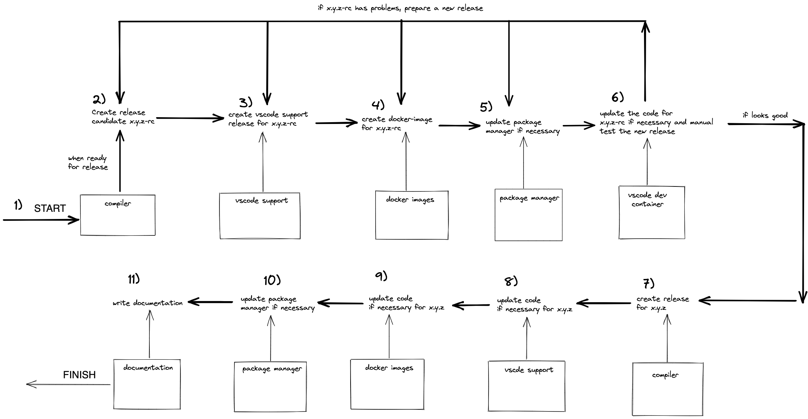
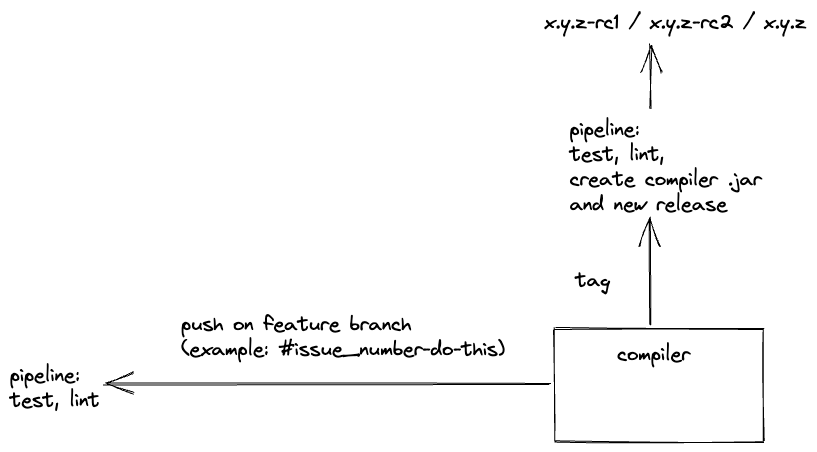

# Icaro ecosystem user POV

 
 

# compiler release workflow

 
 

# compiler day2day workflow

 
 

# vscode support workflow

 
 

# vscode dev container workflow

 
 

# docker images workflow

 
 

# package manager workflow

 
 

# documentation workflow

